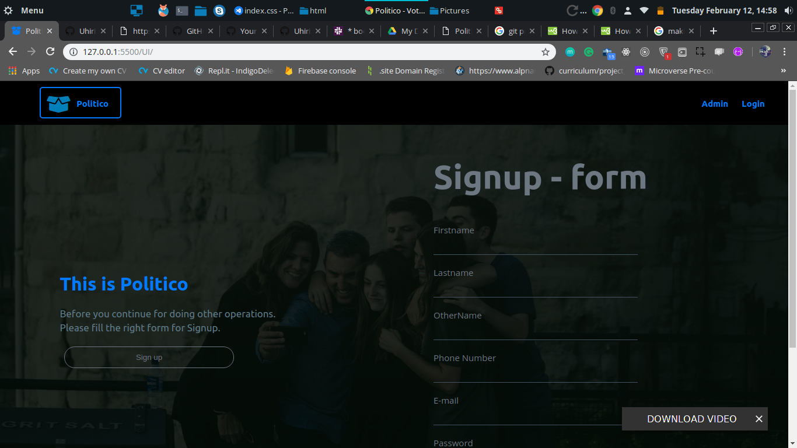
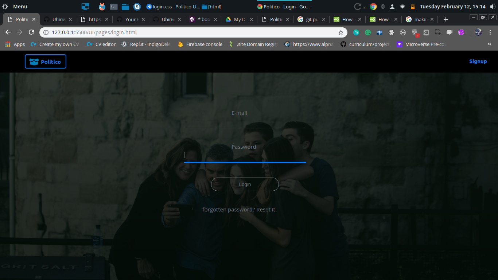
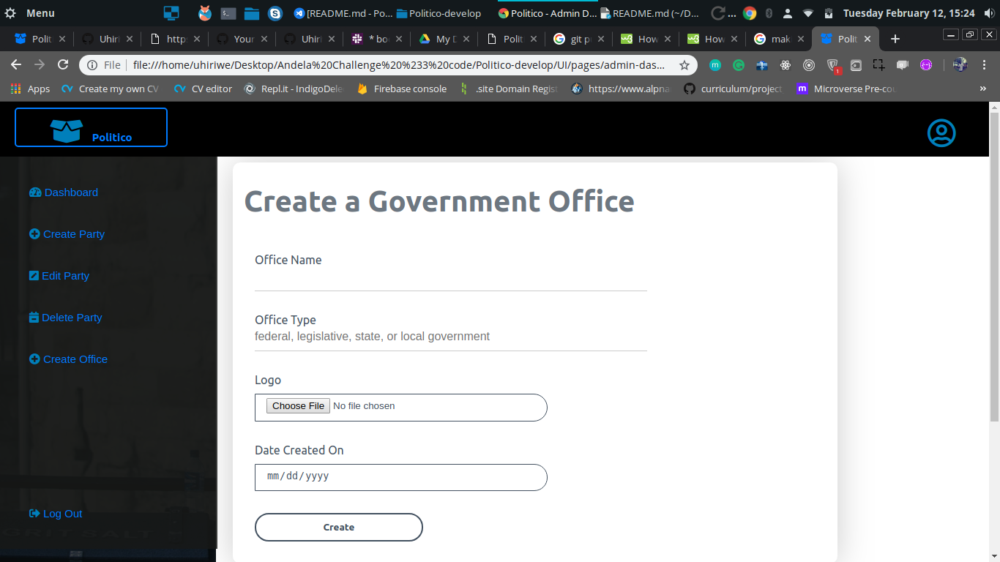
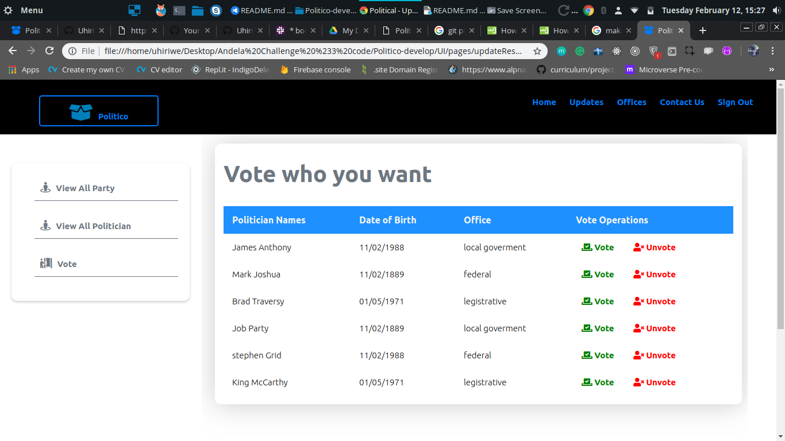

# Politico-UI-Template
This is Politico. Politico is online platform that enables citizens to give their mandate to politicians that are running for different government offices while building trust in the election process through transparency.

 ## Hosted UI:

* [UI Template Link](https://uhiriweaudace.github.io/Politico-UI-Template/)

## Technologies used :

* [Html](https://www.w3schools.com/html/html_intro.asp) is the standard markup language for creating Web pages.

* [CSS](https://www.w3schools.com/css/default.asp) is a language that describes the style of an HTML document.

* [Javascript](https://www.w3schools.com/js/js_intro.asp)is a programming language that adds interactivity to your website.

### Required Features

* Users can sign up.

* Users can login.

* Admin (electoral body) can create political parties.

* Admin (electoral body) can delete a political party.
* Admin (electoral body) can create different political offices .

* Users can vote for only one politician per political office .

* Users can see the results of election.
